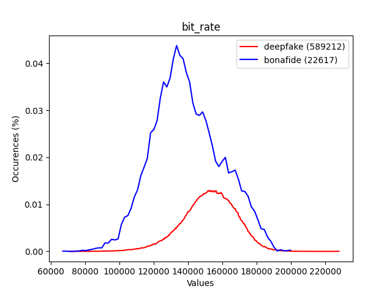
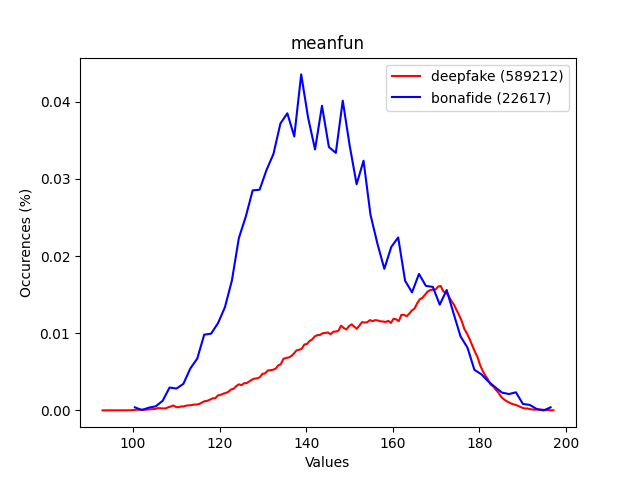
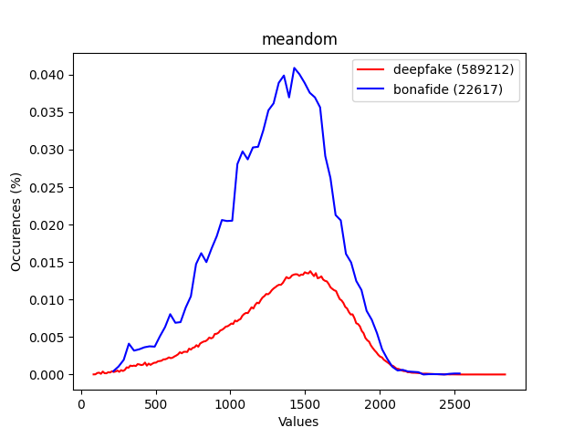
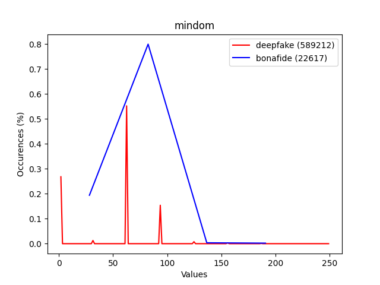
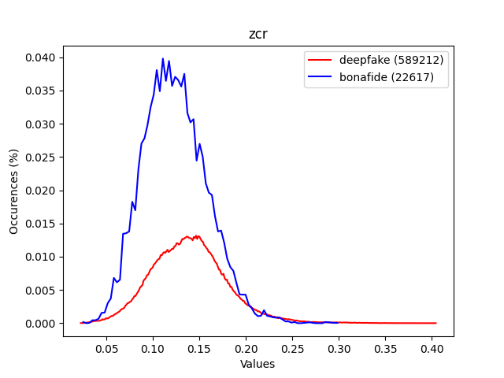
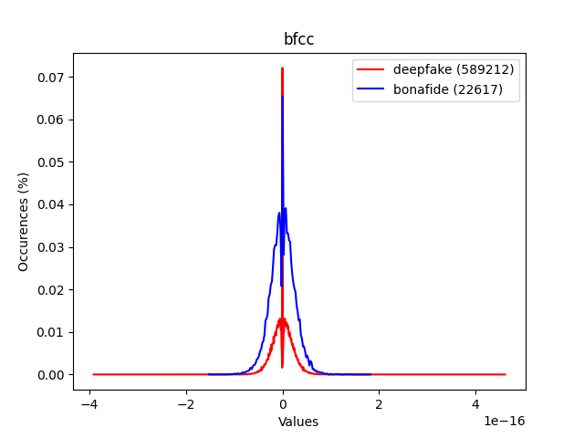
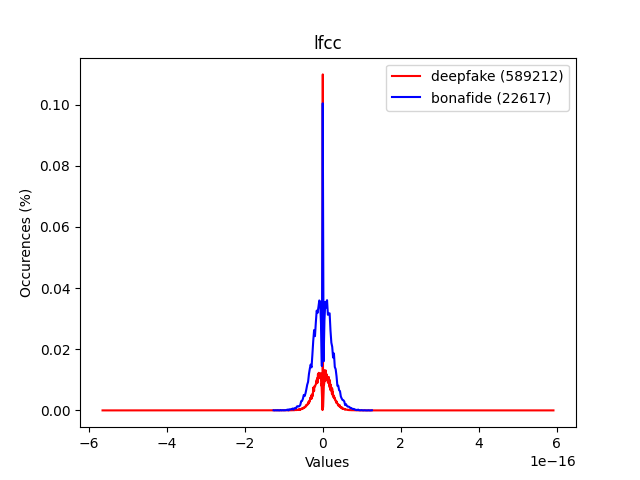

# Fake Audio Detector
Questo progetto si propone l'obiettivo di costruire uno strumento in grado di suddividere file audio in 2 categorie: file audio con voci sintetiche e file audio con voci reali.  
Il tool è costruito tramite modelli di machine learning, per fare ciò ci si serve della libreria sklearn di Python che offre modelli già pronti per l'allenamento, il testing e l'utilizzo vero e proprio.
Il dataset utilizzato è reperibile <a href="https://zenodo.org/record/4835108">qui</a>, pesa approssimativamente 32GB.
Si tratta del dataset offerto da <a href="https://www.asvspoof.org/">ASVspoof</a> che ogni 2 anni propone una challenge che comprende anche la creazione di un modello che possa contraddistinguere audio con voci reali da audio con voci sintetiche. 

### Estrazione delle features
Come step preliminare per la creazione del modello è stato necessario lavorare ad un'estrazione delle features in quanto il dataset contiene dei veri e propri file audio. 
E' necessario per ogni file ottenerne una rappresentazione numerica.
Per questo lavoro lo strumento utilizzato in python è la libreria <a href="https://github.com/SuperKogito/spafe">spafe</a> (versione 0.1.2).
Tramite delle semplici chiamate a funzioni si sono estratte le seguenti features:
bfcc, lfcc, lpc,lpcc,mfcc, imfcc, msrcc, ngcc, psrcc, plp, rplp, mel_filter_banks, bark_filter_banks, gammatone_filter_banks, spectrum, mean_frequency, peak_frequency, frequencies_std, amplitudes_cum_sum,mode_frequency, median_frequency, frequencies_q25, frequencies_q75, iqr, freqs_skewness, freqs_kurtosis,spectral_entropy, spectral_flatness, spectral_centroid, spectral_bandwidth, spectral_spread, spectral_rolloff,energy,rms, zcr, spectral_mean, spectral_rms, spectral_std, spectral_variance, meanfun, minfun, maxfun, meandom, mindom,maxdom, dfrange, modindex, bit_rate.
Lo script di estrazione di features, che è stato chiamato features_extraction.py, si occupa di estrarre le features per ogni file e salvare i risultati in 4 file csv separati.
In quanto i file sono approssimativamente 600.000 si è deciso di parallelizzare il processo in modo tale che i 4 file csv vengano scritti contemporaneamente. I risultati della parallelizzazione sono stati ben visibili: circa 4 giorni di lavoro senza parallelizzazione contro circa 2 giorni di lavoro con parallelizzazione.
Lo script che esegue lo stesso lavoro di features_extraction.py ma parallelizzando è features_extraction_parallel.py.

Note
- Alcune features non sono semplici numeri, sono degli nd array (esempio: bfcc), si è optato per applicare la media, quindi alla fin fine le features che dovrebbero essere nd array saranno semplici numeri
- Stesso discorso vale per quelle features che sarebbero rappresentate tramite tuple, liste
- Eventuali features che sarebbero dei numeri complessi sono state convertite in float tramite la funzione abs() di python

### Estrazione grafici delle features
Lo strumento utilizzato per creare i grafici è stato matplotlib insieme ad alcune funzionalità di numpy.
L'idea è quella di creare 2 istogrammi relativi ai valori dei file sintetici e dei file con voce reale.
Gli istogrammi però hanno la caratteristica di creare delle "barre", porre 2 istogrammi sullo stesso grafico non rende facile la visualizzazione. 
Quello che è stato fatto allora è creare degli istogrammi da convertire poi in curve, le 2 curve nel grafico sono più distinguibili rispetto ai 2 relativi istogrammi.
Si è deciso di graficare le varie features in modo tale da ottenere una rappresentazione di facile comprensione.
L'obiettivo è quello di capire quale features si comportano in maniera ben diversa in base alla natura del file audio.
Purtroppo i risultati ottenuti sperimentando su ASVspoof 2021 non sono stati soddisfacenti come quelli ottenuti da ASVspoof 2019, <a href="https://unict-fake-audio.github.io/ASVspoof2019-feature-webview/dataset-webview/#/?feature=bit_rate&system_id=A07_A19&speaker=LA_0012&feature_per_speaker=1&dataType=0">qui</a> vi è una web app che mostra i grafici ottenuti (vi sono alcune differenze nel dataset tra cui la presenza di speaker e system).
Per la maggior parte delle features la distribuzione dei valori corrispondenti ai file con voce deepfake è risultata essere praticamente identica alla distribuzione dei file con voce vera.
Solamente in 5 features si notano (leggerissime) differenze nella distribuzione, le 5 features sono: bit_rate, meanfun, meandom, mindom e zcr.
Di seguito i grafici delle 5 features  

  

Si riportano ora 2 esempi di features dove le 2 distribuzioni si comportano nella stessa maniera

  
Lo stesso comportamento viene assunto per le altre features

### Creazione del modello
Estratte le features e ottenuti i grafici per comprenderne il comportamento si è passati alla creazione di modelli di classificazione offerti da sklearn per ottenere un tool in grado di distinguere tra audio con voce reale e audio con voce sintetica.
Considerando i risultati non soddisfacenti ottenuti nella creazione dei grafici è facile prevedere che anche i risultati ottenuti allenando i modelli di classificazione non saranno soddisfacenti.
Dai grafici ottenuti precedentemente si è potuta fare una selezione delle features preliminarmente all'allenamento del modello, sono state scartate tutte le features eccetto le 5 che mostravano 2 distribuzioni leggermente diverse.
I modelli allenati sono stati i seguenti: DecisionTreeClassifier, SVC, LogisticRegression, KNeighborsClassifier, LinearDiscriminantAnalysis, RandomForestClassifier, MLPClassifier, AdaBoostClassifier, GaussianNB, MultinomialNB e QuadraticDiscriminantAnalysis.

