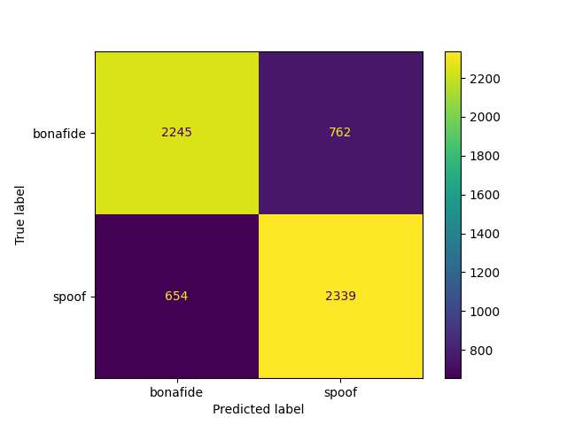

# Fake Audio Detector
Questo progetto si propone l'obiettivo di costruire uno strumento in grado di suddividere file audio in 2 categorie: file audio con voci sintetiche e file audio con voci reali.  
Il tool è costruito tramite modelli di machine learning, per fare ciò ci si serve della libreria sklearn di Python che offre modelli già pronti per l'allenamento, il testing e l'utilizzo vero e proprio.  
Il dataset utilizzato è reperibile <a href="https://zenodo.org/record/4835108">qui</a>, pesa approssimativamente 32GB.  
Si tratta del dataset offerto da <a href="https://www.asvspoof.org/">ASVspoof</a> che ogni 2 anni propone una challenge che comprende anche la creazione di un modello che possa contraddistinguere audio con voci reali da audio con voci sintetiche. 

### Estrazione delle features
Come step preliminare per la creazione del modello è stato necessario lavorare ad un'estrazione delle features in quanto il dataset contiene dei veri e propri file audio.   
E' necessario per ogni file ottenerne una rappresentazione numerica.
Per questo lavoro lo strumento utilizzato in python è la libreria <a href="https://github.com/SuperKogito/spafe">spafe</a> (versione 0.1.2).  
Tramite delle semplici chiamate a funzioni si sono estratte le seguenti features:
bfcc, lfcc, lpc,lpcc,mfcc, imfcc, msrcc, ngcc, psrcc, plp, rplp, mel_filter_banks, bark_filter_banks, gammatone_filter_banks, spectrum, mean_frequency, peak_frequency, frequencies_std, amplitudes_cum_sum,mode_frequency, median_frequency, frequencies_q25, frequencies_q75, iqr, freqs_skewness, freqs_kurtosis,spectral_entropy, spectral_flatness, spectral_centroid, spectral_bandwidth, spectral_spread, spectral_rolloff,energy,rms, zcr, spectral_mean, spectral_rms, spectral_std, spectral_variance, meanfun, minfun, maxfun, meandom, mindom,maxdom, dfrange, modindex, bit_rate.  
Lo script di estrazione di features, che è stato chiamato features_extraction.py, si occupa di estrarre le features per ogni file e salvare i risultati in un file csv.
In quanto i file sono approssimativamente 600.000 si è deciso di parallelizzare il processo in modo tale che i 4 file csv vengano analizzati contemporaneamente. I risultati della parallelizzazione sono stati ben visibili: circa 4 giorni di lavoro senza parallelizzazione contro circa 2 giorni di lavoro con parallelizzazione.
Lo script che esegue lo stesso lavoro di features_extraction.py ma parallelizzando è features_extraction_parallel.py.

Note
- Alcune features non sono semplici numeri, sono degli nd array (esempio: bfcc), si è optato per applicare la media, quindi alla fin fine le features che dovrebbero essere nd array saranno semplici numeri
- Stesso discorso vale per quelle features che sarebbero rappresentate tramite tuple, liste
- Eventuali features che sarebbero dei numeri complessi sono state convertite in float tramite la funzione abs() di python

### Estrazione grafici delle features
Lo strumento utilizzato per creare i grafici è stato matplotlib insieme ad alcune funzionalità di numpy.  
L'idea è quella di creare 2 istogrammi relativi ai valori dei file con voce sintetica e dei file con voce reale.  
Gli istogrammi però hanno la caratteristica di creare delle "barre", porre 2 istogrammi sullo stesso grafico non rende facile la visualizzazione.  
Quello che è stato fatto allora è creare degli istogrammi da convertire poi in curve, le 2 curve nel grafico sono più distinguibili rispetto ai 2 relativi istogrammi.  
Si è deciso di graficare le varie features in modo tale da ottenere una rappresentazione di facile comprensione.
L'obiettivo è quello di capire quali features si comportano in maniera ben diversa in base alla natura del file audio.  
Purtroppo i risultati ottenuti sperimentando su ASVspoof 2021 non sono stati soddisfacenti come quelli ottenuti da ASVspoof 2019, <a href="https://unict-fake-audio.github.io/ASVspoof2019-feature-webview/dataset-webview/#/?feature=bit_rate&system_id=A07_A19&speaker=LA_0012&feature_per_speaker=1&dataType=0">qui</a> vi è una web app che mostra i grafici ottenuti (vi sono alcune differenze nel dataset tra cui la presenza di speaker e system).  
Per la maggior parte delle features la distribuzione dei valori corrispondenti ai file con voce deepfake è risultata essere praticamente identica alla distribuzione dei file con voce vera.  
Solamente in 5 features si notano (leggerissime) differenze nella distribuzione, le 5 features sono: bit_rate, meanfun, meandom, mindom e zcr.  
Di seguito i grafici delle 5 features  

  

Si riportano ora 2 esempi di features dove le 2 distribuzioni si comportano nella stessa maniera  

  
Lo stesso comportamento viene assunto per le altre features

### Creazione del modello
Estratte le features e ottenuti i grafici per comprenderne il comportamento si è passati all'allenamento di modelli di classificazione offerti da sklearn per ottenere un tool in grado di distinguere tra audio con voce reale e audio con voce sintetica.  
Considerando i risultati non soddisfacenti ottenuti nella creazione dei grafici è facile prevedere che anche i risultati ottenuti allenando i modelli di classificazione non saranno soddisfacenti.  
Dai grafici ottenuti precedentemente si è potuta fare una selezione delle features preliminarmente all'allenamento del modello, sono state scartate tutte le features eccetto le 5 che mostravano 2 distribuzioni leggermente diverse.  
I modelli allenati sono stati i seguenti: DecisionTreeClassifier, SVC, LogisticRegression, KNeighborsClassifier, LinearDiscriminantAnalysis, RandomForestClassifier, MLPClassifier, AdaBoostClassifier, GaussianNB, MultinomialNB e QuadraticDiscriminantAnalysis.  

### Risultati del training
Vengono mostrati i valori delle metriche memorizzate ottenuti dopo aver testato il modello.  
Le metriche sono: EER, accuracy, accuracy per class, precision e recall.  
Il modello viene trainato e testato per 10 volte.  
Viene preso in considerazione il modello con l'EER più vicino alla media

Nota
- I risultati sono approssimati alla quarta cifra decimale

| Model                             | EER       | Accuracy   | Accuracy per class | Precision | Recall     |
|-----------------------------------|-----------|------------|--------------------|-----------|------------|
| **DecisionTreeClassifier**        |0.1578     |0.6845      |0.6845              |0.6884     |0.6799      |
| **SVC**                           |0.1638     |0.6725      |0.6718              |0.7507     |0.5122      |
| **LogisticRegression**            |0.2083     |0.5833      |0.5832              |0.5802     |0.5716      |
| **KNeighborsClassifier**          |0.2054     |0.5891      |0.5930              |0.5558     |0.8155      |
| **LinearDiscriminantAnalysis**    |0.1618     |0.6765      |0.6766              |0.6881     |0.65        |
| **RandomForestClassifier**        |0.118      |0.764       |0.7640              |0.7744     |0.7466      |
| **MLPClassifier**                 |0.2463     |0.5075      |0.5                 |0.0        |0.0         |
| **AdaBoostClassifier**            |0.1528     |0.6945      |0.6950              |0.7170     |0.6560      |
| **GaussianNB**                    |0.1593     |0.6813      |0.6812              |0.7002     |0.6320      |
| **MultinomialNB**                 |0.1957     |0.6085      |0.6086              |0.5979     |0.6592      |
| **QuadraticDiscriminantAnalysis** |0.1534     |0.6932      |0.6929              |0.7253     |0.6184      |

Guardando la tabella con attenzione si nota che il modello di classificazione che si è dimostrato migliore dopo il testing è RandomForestClassifier con un EER pari a 0.118.  
Invece il modello peggiore è stato MLPClassifier con un EER pari a 0.24625, inoltre guardando i valori delle altre metriche di questo modello si notano valori insoliti sicuramente dovuti a problemi di imprecisione.  
Si riporta la confusion matrix di RandomForestClassifier  

### Classificatori Naive
Oltre ai classici modelli offerti dalla libreria sklearn si è optato per costruire 2 classificatori naive basati sulla feature bit_rate  
Il primo classificatore molto banalmente prima calcola il valore medio del bit_rate sia per gli audio spoof sia per gli audio bonafide, successivamente per classificare un'osservazione calcolerà la distanza del corrispondente bit_rate dalle 2 medie. 
Verrà assegnata la label corrispondente alla media più vicina.  
Ad esempio se le 2 medie fossero 1.2 per spoof e 3.1 per bonafide e l'osservazione avesse bit_rate pari a 2.5 la label assegnata sarebbe bonafide.  
Il secondo classificatore invece cerca di trovare un valore idoneo per una soglia, trovata la soglia il classificatore si comporterà semplicemente come un if-else, cioè se la feature dell'osservazione supera la soglia viene assegnata classe X altrimenti classe Y.  
Per trovare una soglia vicina all'ideale molto semplicemente si è suddiviso lo spazio tra il valore minimo e massimo della feature per 100 e si sono poi provate 100 soglie, viene presa in considerazione la soglia il cui relativo EER è il più basso.  
Ad esempio se il valore minimo fosse 70.000 e il massimo fosse 210.000, si dovrebbe calcolare (210000 - 70000)/100 che risulta 1400.  
Le soglie che verranno provate sono: 70.000, 71.400, 72.800 ..., 208.600, 210.000, la soglia con l'EER più basso sarà considerata la soglia ideale.  
Nota
- se si volesse trovare un valore ancora più accurato come soglia basterebbe usare un valore più alto di 100

### Risultati e Metriche dei classificatori Naive
Come prima mostriamo i risultati ottenuti dopo il training e il testing del modello.  
Per il primo classificatore possiamo immaginare il training come se fosse il calcolo delle 2 medie, mentre per il secondo classificatore non vi è una sorta di allenamento, è una successione di tentativi mirati a cercare il valore ideale per la soglia  
| Model                         | EER       | Accuracy   | Accuracy per class | Precision | Recall     |
|-------------------------------|-----------|------------|--------------------|-----------|------------|
| **Naive_mean**                |0.1674     |0.6651      |0.6651              |0.6701     |0.6503      |
| **Naive_th**                  |0.1628     |0.6744      |0.6744              |0.7448     |0.5308      |
 
